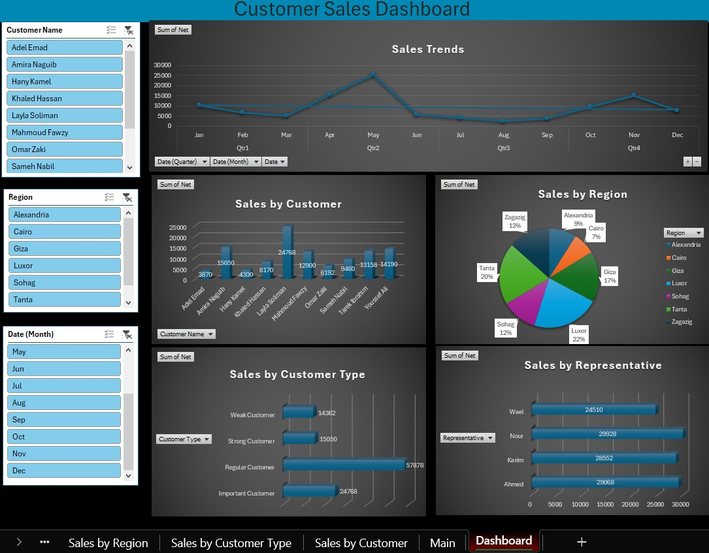

# Customer Sales Dashboard (Excel Project)

## 📌 Overview
This project is an interactive Excel dashboard designed to analyze customer sales data and transform it into actionable business insights.

## 📊 Dashboard Preview

## 📊 Dashboard Highlights:
• Sales trends analysis over time
• Sales breakdown by customer, region, customer type, and sales representative

## 🛠️ Tools Used
Microsoft Excel (Pivot Tables, Charts, Slicers)

## 📈 Key Insights
-  Luxor achieved the highest net sales among all regions (22%).
-  Regular customers contributed the largest share of total revenue (51.65%).
-  Q2 outperformed all other quarters, driven by a strong peak in May.

## 👨‍💻 Author
Mohamed Ayman
